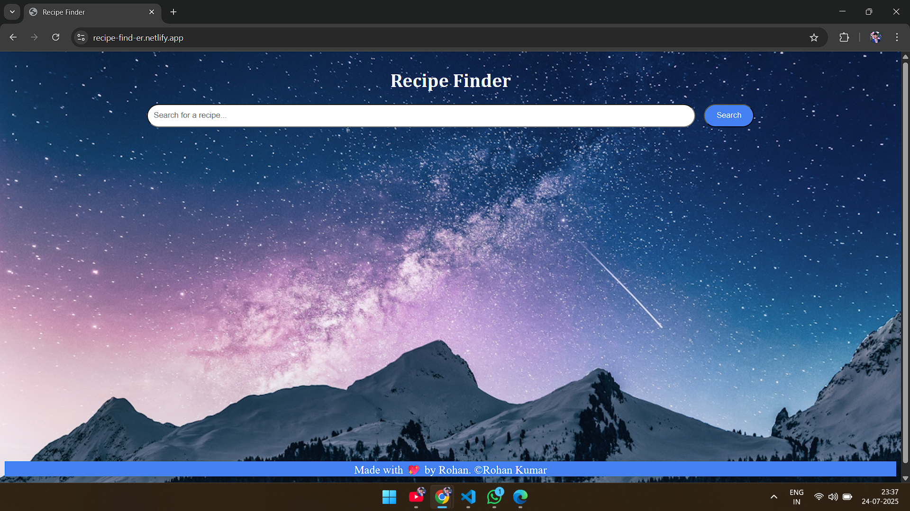
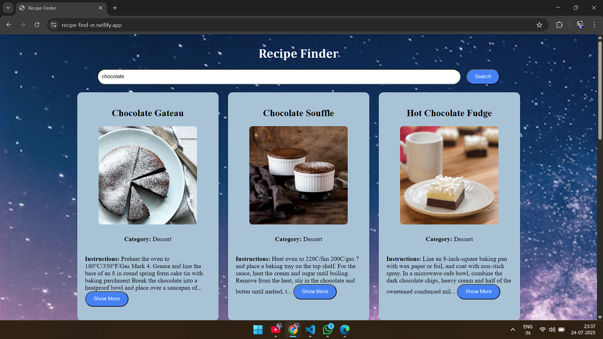
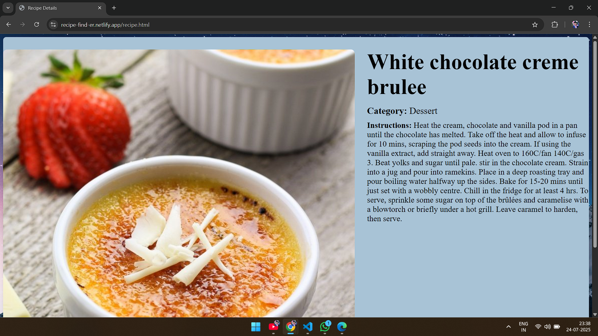
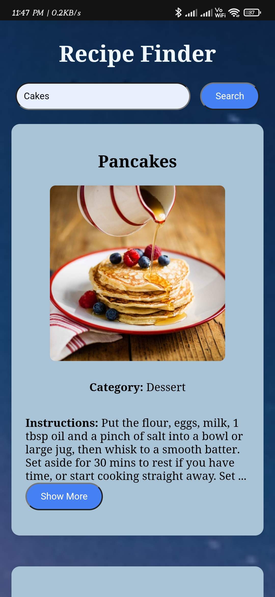
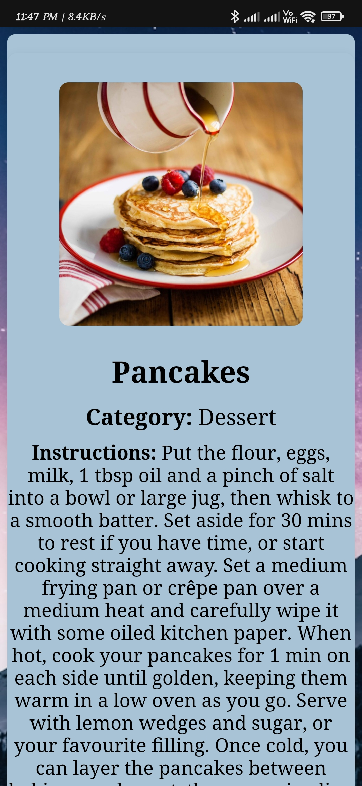

# Recipe Finder

Recipe Finder is a simple web app that lets you search for recipes by name, view a list of matching recipes as cards, and see full details for any recipe. It uses [TheMealDB API](https://www.themealdb.com/api.php) for recipe data.

---

## Live Demo

👉 **[View Live Page](https://recipe-find-er.netlify.app/)**  

---

## Screenshots

### Desktop
 
 
 

### Mobile




---


## Features

- **Search Recipes:** Enter a recipe name and click "Search" to see matching recipes.
- **Recipe Cards:** Results are shown as cards with image, name, category, and a short description.
- **Show More:** If instructions are long, click "Show More" to view the full recipe on a separate page.
- **Responsive Design:** Works well on desktop and mobile. On small screens, recipe images stack above the description.
- **Sticky Footer:** Footer stays at the bottom even if the page is empty or short.
- **Background Image:** Attractive full-screen background image for a modern look.

---

## How to Use

1. **Open `index.html` in your browser.**
2. **Type a recipe name** (e.g., "chicken") in the search box and click **Search**.
3. **Browse the results:** Each recipe appears as a card.
4. **See full details:** Click the "Show More" button on any card to view the complete recipe instructions on a new page.
5. **Return:** Use your browser's back button to return to your search results.

---

## Project Structure

```
.
├── index.html
├── styles.css
└── script.js
```

- **`index.html`:** The main HTML file.
- **`styles.css`:** The CSS file for styling the app.
- **`script.js`:** The JavaScript file for app functionality.

---

## Technologies Used

- **HTML5:** For structuring the content.
- **CSS3:** For styling and layout.
- **JavaScript:** For interactive features.
- **TheMealDB API:** For fetching recipe data.

---

## Future Improvements

- **User Authentication:** Allow users to save their favorite recipes.
- **Advanced Search Filters:** By ingredients, cuisine, cooking time, etc.
- **Shopping List Feature:** Generate a shopping list based on selected recipes.
- **Meal Planner:** Plan your meals for the week using selected recipes.

---

## Technical Details

- **API:** Uses [TheMealDB](https://www.themealdb.com/api.php) for recipe data.
- **State:** Remembers your last search and restores results when returning from the details page.
- **Cards:** Each recipe is shown as a card with image on the left (desktop) or top (mobile).
- **Navigation:** "Show More" saves the selected recipe in `localStorage` and opens `recipe.html`.
- **Responsive:** Uses CSS Flexbox and media queries for layout.
- **Footer:** Always at the bottom, using flexbox layout.

---

## Customization

- **Change the background:** Edit the `background-image` property in `style.css`.
- **Change the footer text:** Edit the `<footer>` in `index.html` and `recipe.html`.
- **Adjust card size or style:** Edit the `.recipe` and `.recipe-detail-card` classes in `style.css`.

---

## Credits

- **API:** [TheMealDB](https://www.themealdb.com/api.php)
- **Background Image:** Unsplash

---

## License

This project is for educational/demo purposes.  
Feel free to use and modify it for your own projects.